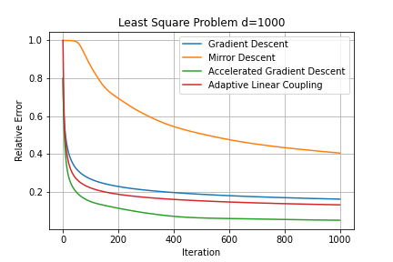

# MA574 Final Project
This the final project for MA574. The course homepage is [here](https://www.math.purdue.edu/~zhan1966/teaching/574/index.html).

In this project, we investigate linear coupling methods between gradient descent and mirror descent. We go through the proof details of [Zhu et al. (2014)](https://arxiv.org/pdf/1407.1537) and implement the algorithm in Python.

We test the algorithm on a simlpe least square problem. The convergence plot is shown below.

## Project Report

The project report is [here](math_574.pdf).

## Project Code

The project code is [here](final_proj.ipynb).
